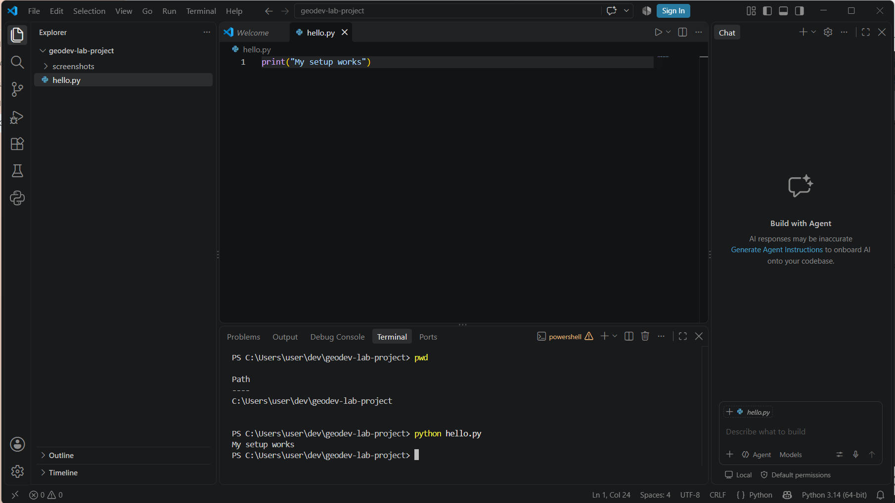

# Flood Mapping & Mitigation Across Lagos State

This project is directed to *Lagos State Urban and Regional Planners,* which states the **causes of flood, the risks it brings,** 
**and the solution needed to solve the flooding problem across Lagos, Nigeria.**

***GeoDev Lab Africa, Cohort One.***

See [**01-project-brief.md**](docs/01-project-brief.md) for the full brief.

---

## The Question

> Which buildings and roads in **Lagos State** are at high risk of flooding, and
> where are the ***three (3)*** best public sites to build water basins in each
> **Local Government Area (LGA)** to help manage that risk?

## Project Structure

```
Flood Mapping & Mitigation/
└── docs/
    └── 01-project-brief.md           Week 1
    └── 02-data-notes.md              Week 2
    └── 03-data-preparation.md        Week 3
    └── 04-month-1-summary.md         Week 4
└── data/
    └── raw/                          downloaded,
not committed
    └── processed/                    output,
└── scripts/
└── screenshots/
    └── week5.png                     Week 5
└── requirements.txt
```

## Progress

- [x] Week 1, project brief with a source link for every dataesets
- [x] Week 2, data downloaded, opened, and described
- [x] Week 3, reprojected, clipped, and quality check
- [ ] Week 4, first spatial analysis
- [x] Week 5, `hello.py` runs

## Month 2: Development Environment and Early Python
- Week 5: Setup *Python, VS Code, and the Terminal.* `hello.py` runs



---

Ahmad Jibril-Adeyemi. GeoDev Lab Africa.

*`Learn` `Build` `Collaborate` `Transform`*
